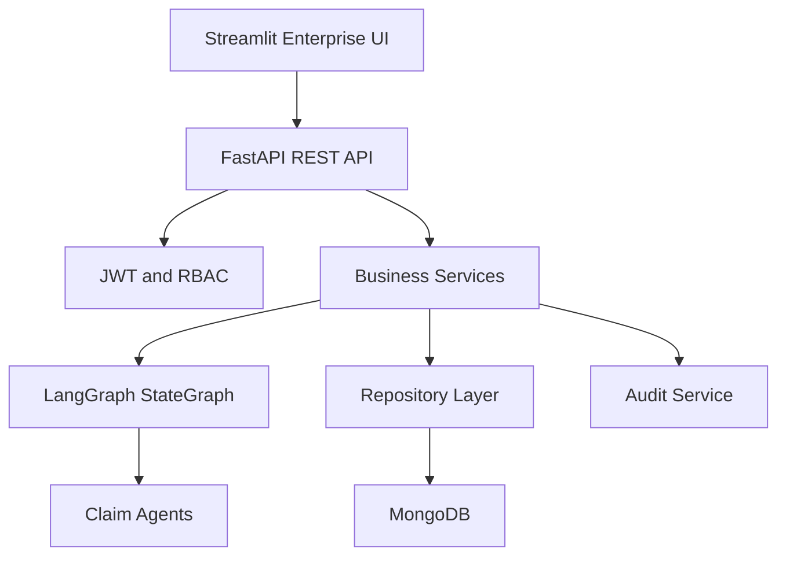
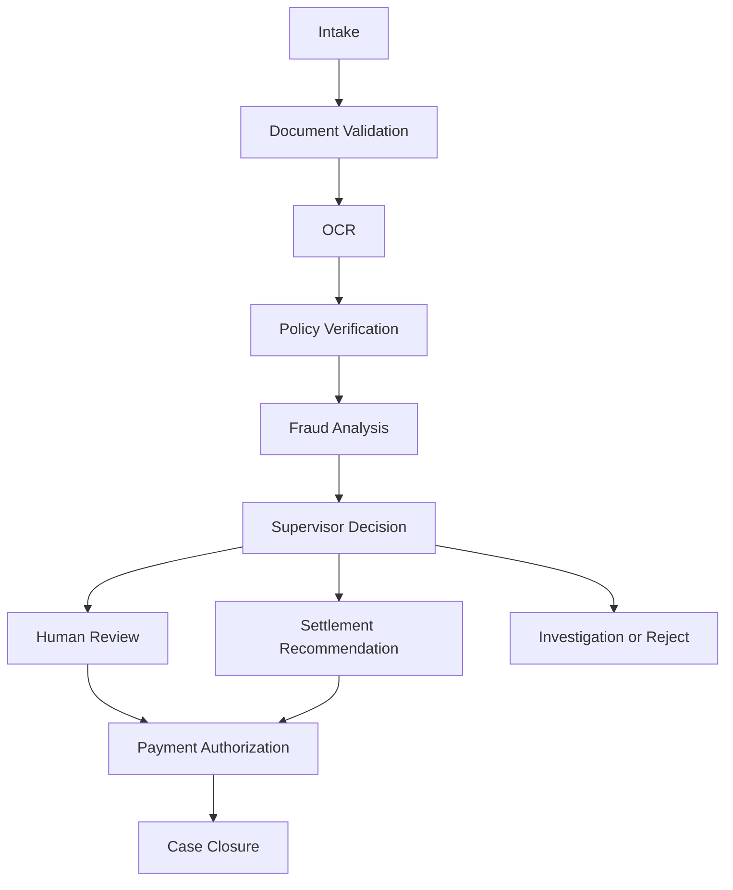

# ClaimGuard AI

ClaimGuard AI is an enterprise insurance claims orchestration platform for automating claim intake, policy verification, fraud analysis, human approval, settlement recommendation, reporting, and auditability.

The system is designed as a production-quality hackathon submission with the architecture, security posture, and operational surface expected from mature enterprise SaaS products.

## Capabilities

- Executive dashboard with operational KPIs
- Claims inventory, search, filtering, and CSV export
- New claim intake with immediate AI orchestration
- Claim detail view with timeline, decision evidence, and agent explanations
- Fraud intelligence queue with prioritized risk scores
- Human approval workbench
- AI agent command center
- Audit logs and report endpoints
- Admin role matrix and runtime settings
- JWT authentication and role-based access control
- Rate limiting, CORS, secure headers, password hashing, and typed validation
- MongoDB repository with in-memory fallback for local testing
- Docker Compose deployment for MongoDB, FastAPI, and Streamlit

## Architecture



## Claim Lifecycle



## Folder Structure

| Path | Purpose |
|---|---|
| `backend/app/api` | REST API routers and dependency injection |
| `backend/app/agents` | LangGraph StateGraph, state, and agent nodes |
| `backend/app/core` | Configuration, logging, security, middleware |
| `backend/app/models` | Pydantic domain and API models |
| `backend/app/repositories` | MongoDB and in-memory repositories |
| `backend/app/services` | Business logic and orchestration services |
| `backend/tests` | pytest API tests |
| `frontend/app.py` | Streamlit enterprise UI |
| `frontend/components` | UI and API helper components |
| `frontend/assets` | CSS theme |

## Local Installation

```bash
cd ClaimGuard-AI
cp .env.example .env
```

Backend:

```bash
cd backend
python -m venv .venv
source .venv/bin/activate
pip install -r requirements.txt
export USE_MONGO=false
export SECRET_KEY=test-secret-key-for-local-development
uvicorn app.main:app --reload --port 8000
```

Frontend:

```bash
cd frontend
python -m venv .venv
source .venv/bin/activate
pip install -r requirements.txt
export CLAIMGUARD_API_URL=http://localhost:8000/api
streamlit run app.py
```

## Default Accounts

| Email | Password | Role |
|---|---|---|
| `admin@claimguard.ai` | `ClaimGuard@2026` | admin |
| `adjuster@claimguard.ai` | `Adjuster@2026` | adjuster |
| `reviewer@claimguard.ai` | `Reviewer@2026` | reviewer |

## Docker Deployment

```bash
cd ClaimGuard-AI
cp .env.example .env
docker compose up --build
```

Services:

| Service | URL |
|---|---|
| Streamlit UI | `http://localhost:8501` |
| FastAPI API | `http://localhost:8000` |
| API Docs | `http://localhost:8000/api/docs` |
| MongoDB | `mongodb://localhost:27017` |

## API Surface

| Route | Purpose |
|---|---|
| `/api/auth/login` | JWT authentication |
| `/api/claims` | Claims inventory and claim creation |
| `/api/claims/{case_id}` | Claim detail |
| `/api/claims/{case_id}/process` | Run orchestration |
| `/api/claims/{case_id}/decision` | Decision recommendation |
| `/api/claims/{case_id}/approve` | Human approval |
| `/api/agents/status` | Agent command center status |
| `/api/dashboard/kpis` | Executive KPIs |
| `/api/analytics` | Analytics payload |
| `/api/audit` | Audit logs |
| `/api/reports/claims.csv` | CSV report |
| `/api/reports/claims.json` | JSON report |
| `/api/reports/executive.pdf` | PDF report |
| `/api/settings` | Runtime settings |
| `/api/health` | Health check |

## Security Design

- JWT access tokens signed with configurable secret
- Role-based access control for claims, approvals, audit, and settings
- Password hashing with bcrypt
- Pydantic input validation for all request payloads
- Rate limiting middleware
- Secure response headers
- CORS configuration through environment variables
- No hardcoded deployment secrets
- Structured JSON logging
- Audit events for sensitive actions

## Testing

```bash
cd ClaimGuard-AI/backend
export USE_MONGO=false
export SECRET_KEY=test-secret-key-for-claimguard
pytest
```

## Future Roadmap

- External document OCR provider integration
- Payment gateway authorization workflow
- Model registry and champion-challenger fraud models
- Distributed tracing with OpenTelemetry
- Fine-grained policy administration
- SSO with SAML or OIDC
- Immutable audit export to enterprise data lake
