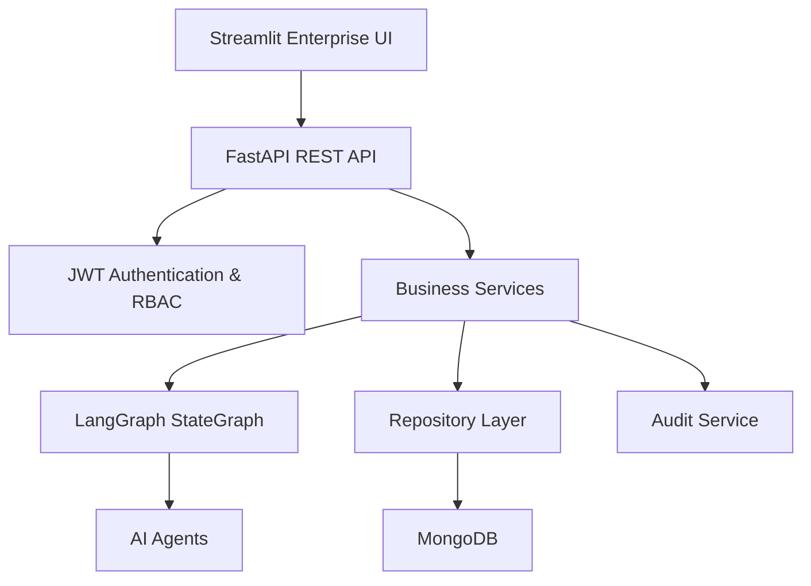

# ClaimGuard AI

> Enterprise AI-Powered Insurance Claims Orchestration Platform

ClaimGuard AI is an enterprise-grade insurance claims orchestration platform that automates the complete claims lifecycle using intelligent AI agents, explainable decision-making, and human-in-the-loop approvals. The platform streamlines claim intake, policy verification, fraud analysis, settlement recommendations, reporting, and auditability through a modular, scalable architecture.

---

# Business Problem

Insurance claims processing is often slow, manual, and fragmented across multiple systems. Adjusters spend significant time validating documents, verifying policy coverage, detecting fraud, coordinating approvals, and maintaining compliance.

ClaimGuard AI accelerates claims processing by orchestrating specialized AI agents, automating repetitive tasks, assisting human reviewers, and providing explainable recommendations while maintaining enterprise governance and auditability.

---

# Project Description

ClaimGuard AI provides an end-to-end AI-powered insurance claims workflow including:

- Claim Intake
- Document Validation
- OCR Processing
- Policy Verification
- Fraud Detection
- Settlement Recommendation
- Human Review & Approval
- Executive Analytics
- Audit Logging
- Reporting

The platform is built using FastAPI, Streamlit, LangGraph, MongoDB, JWT Authentication, and Docker with an enterprise-first modular architecture.

---

# UiPath Components Used

This solution is designed to integrate with the UiPath Platform.

Current implementation includes:

- UiPath Automation Cloud (Hackathon Environment)
- UiPath Maestro BPMN
- API Workflows
- Coding Agents
- Human-in-the-loop Workflow

External AI Components:

- LangGraph
- FastAPI
- Streamlit
- MongoDB

> **Note:** External AI agents are orchestrated through LangGraph. UiPath Automation Cloud serves as the enterprise orchestration environment for the hackathon submission.

---

# Agent Type

**Coding Agents**

ClaimGuard AI utilizes Python-based coded agents built with LangGraph and FastAPI.

---

# AI Agents

- Intake Agent
- OCR Agent
- Document Validation Agent
- Policy Verification Agent
- Fraud Detection Agent
- Duplicate Claim Detection Agent
- Settlement Recommendation Agent
- Human Review Agent
- Compliance Agent
- Audit Agent
- Notification Agent
- Supervisor Agent

---

# Architecture



---

# Claim Workflow

```text
Claim Intake
      ↓
Document Validation
      ↓
OCR Processing
      ↓
Policy Verification
      ↓
Fraud Detection
      ↓
Supervisor Decision
      ↓
Human Review (if required)
      ↓
Settlement Recommendation
      ↓
Payment Authorization
      ↓
Case Closure
```

---

# Technology Stack

### Frontend

- Streamlit
- Plotly
- Custom CSS

### Backend

- FastAPI
- Pydantic

### AI

- LangGraph
- Python

### Database

- MongoDB

### Security

- JWT Authentication
- RBAC
- Password Hashing

### DevOps

- Docker
- Docker Compose

---

# Folder Structure

```
ClaimGuard-AI
│
├── backend
│   ├── api
│   ├── agents
│   ├── services
│   ├── repositories
│   ├── models
│   └── core
│
├── frontend
│   ├── assets
│   ├── components
│   └── app.py
│
└── docker-compose.yml
```

---

# Prerequisites

- Python 3.11+
- Git
- MongoDB (optional)
- Docker (optional)

---

# Setup Instructions

## Clone Repository

```bash
git clone https://github.com/NikhilRaman12/ClaimguardAI
```

```bash
cd ClaimGuard-AI
```

---

## Backend

```bash
cd backend

python -m venv .venv

pip install -r requirements.txt

uvicorn app.main:app --reload --port 8000
```

---

## Frontend

```bash
cd frontend

pip install -r requirements.txt

streamlit run app.py
```

---

# Default Accounts

| Email | Password | Role |
|--------|----------|------|
| admin@claimguard.ai | ClaimGuard@2026 | Admin |
| adjuster@claimguard.ai | Adjuster@2026 | Adjuster |
| reviewer@claimguard.ai | Reviewer@2026 | Reviewer |

---

# Docker

```bash
docker compose up --build
```

---

# Security

- JWT Authentication
- Role-Based Access Control
- Password Hashing
- Secure API Design
- Structured Logging
- Audit Trails
- Input Validation
- Rate Limiting
- CORS

---

# API Endpoints

- `/api/auth`
- `/api/claims`
- `/api/dashboard`
- `/api/analytics`
- `/api/agents`
- `/api/reports`
- `/api/settings`
- `/api/audit`
- `/api/health`

---

# Future Roadmap

- Intelligent OCR
- Enterprise Payment Gateway
- Predictive Fraud Models
- OpenTelemetry Observability
- Enterprise SSO
- Cloud-native Deployment
- Advanced Explainable AI

---

# License

MIT License
